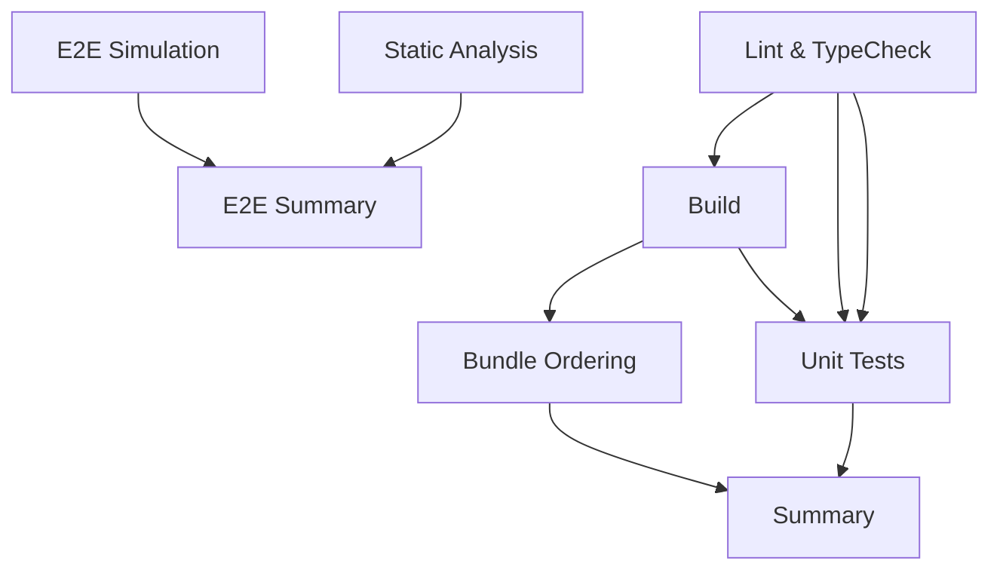

# CI/CD Pipeline Documentation

This document explains the CI/CD setup for the JIT Bot project and how to enable optional testing features.

## Overview

The CI pipeline consists of two main workflows:

1. **Main CI Pipeline** (`.github/workflows/ci.yml`) - Runs on all PRs and pushes
2. **E2E & Static Analysis** (`.github/workflows/ci-e2e.yml`) - Optional tests with additional requirements

## Main CI Pipeline

The main CI pipeline runs the following jobs on every PR and push to `main`/`develop`:

### Mandatory Jobs

1. **Lint and TypeCheck**
   - ESLint code quality checks
   - TypeScript compilation validation
   - Node.js 20 runtime

2. **Build**
   - TypeScript compilation
   - Contract compilation (with fallback for network issues)
   - Dependency on lint-typecheck

3. **Unit Tests**
   - All unit tests in `test/unit/`
   - Network-isolated tests
   - Mock RPC endpoints for testing

4. **Bundle Ordering Tests**
   - Flashbots bundle creation validation
   - Victim transaction fixture validation
   - MEV bundle structure verification

5. **Summary**
   - Reports overall CI status
   - All mandatory jobs must pass for green status

### CI Requirements

- **No network dependencies** - All tests run offline
- **No secrets required** - Uses mock data and localhost endpoints
- **Deterministic results** - Same code always produces same result

## E2E & Static Analysis Pipeline

The E2E pipeline provides additional testing capabilities that require external resources:

### Optional Jobs

1. **E2E Fork Simulation**
   - **Enabled when**: `RPC_URL_HTTP` and `FORK_BLOCK_NUMBER` variables are set
   - Tests fork-based simulations against real blockchain data
   - Validates flashloan orchestrator integration
   - Generates and uploads simulation reports

2. **Static Analysis (Slither)**
   - **Enabled when**: `SLITHER_ENABLE` variable is set to `'true'`
   - Runs Slither security analysis on Solidity contracts
   - Uploads analysis reports as artifacts

### Environment Variables

To enable E2E tests, set these repository variables:

```bash
# Required for E2E fork simulation
RPC_URL_HTTP=https://eth-mainnet.alchemyapi.io/v2/YOUR_KEY
FORK_BLOCK_NUMBER=18500000
RPC_URL_WS=wss://eth-mainnet.ws.alchemyapi.io/v2/YOUR_KEY

# Optional for static analysis
SLITHER_ENABLE=true
```

### Secrets

E2E tests may use these optional secrets:

```bash
# For enhanced fork testing
MAINNET_RPC_URL=https://eth-mainnet.alchemyapi.io/v2/YOUR_KEY
```

## Job Dependencies



### Main CI
- All jobs run in parallel after lint-typecheck
- Summary depends on all mandatory jobs
- **All jobs must pass for merge**

### E2E CI
- Jobs are independent and optional
- **Failures do not block merge**
- Jobs only run when explicitly enabled

## Testing Locally

### Run Main CI Checks

```bash
# Install dependencies
npm ci

# Run all main CI checks
npm run lint          # ESLint
npm run typecheck     # TypeScript check
npm run build         # Build (with fallback)
npm run test:unit     # Unit tests

# Individual components
npm run build:ts      # TypeScript only
npm run build:contracts # Hardhat compile
```

### Run E2E Tests

```bash
# Set environment variables
export RPC_URL_HTTP="https://eth-mainnet.alchemyapi.io/v2/YOUR_KEY"
export FORK_BLOCK_NUMBER="18500000"
export SLITHER_ENABLE="true"

# Run E2E tests
npm run test:fork
npm run slither      # If Slither is installed
```

## Troubleshooting

### Build Failures

**Contract compilation fails**: The build script includes a fallback for network issues. If Solidity contracts need compilation but `binaries.soliditylang.org` is blocked:

1. Ensure `solc` npm package is installed: `npm install solc@0.8.19`
2. The build will continue with a warning message
3. Existing artifacts will be used if available

### Test Failures

**Unit tests fail with RPC errors**: Unit tests should not require network access. If they fail:

1. Check that tests use mock providers
2. Verify environment variables are set correctly
3. Review test isolation and mocking

**E2E tests skipped**: E2E tests only run when variables are set:

1. Set `RPC_URL_HTTP` and `FORK_BLOCK_NUMBER` repository variables
2. Ensure variables are available to the workflow
3. Check repository settings > Variables

### Static Analysis

**Slither not running**: Slither requires explicit enablement:

1. Set `SLITHER_ENABLE=true` in repository variables
2. Ensure Python environment setup succeeds
3. Check Slither installation logs

## CI Strategy

### PR Workflow
1. **Fast feedback**: Main CI completes in ~3-5 minutes
2. **No external dependencies**: Works in any environment
3. **Blocking only on core issues**: Lint, type, unit test, build failures

### Production Readiness
1. **Optional E2E validation**: Comprehensive testing when needed
2. **Security scanning**: Slither analysis for contract security
3. **Artifact collection**: Reports and logs for debugging

### Merge Requirements
- All mandatory CI jobs must pass
- E2E jobs are informational only
- No secrets required for basic development workflow

This design ensures the CI pipeline is:
- **Fast and reliable** for daily development
- **Comprehensive** when full validation is needed
- **Accessible** to contributors without special setup requirements